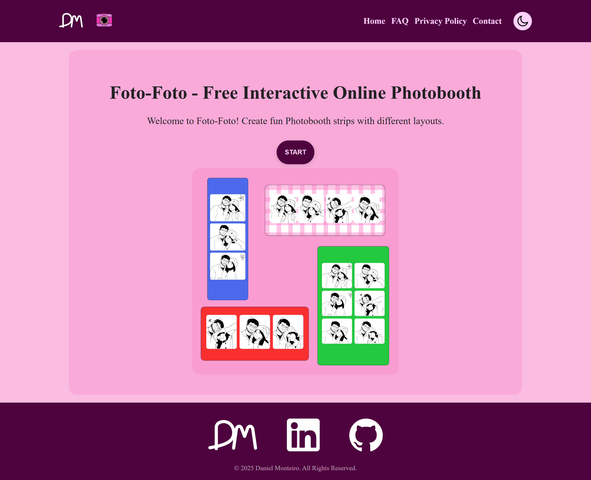
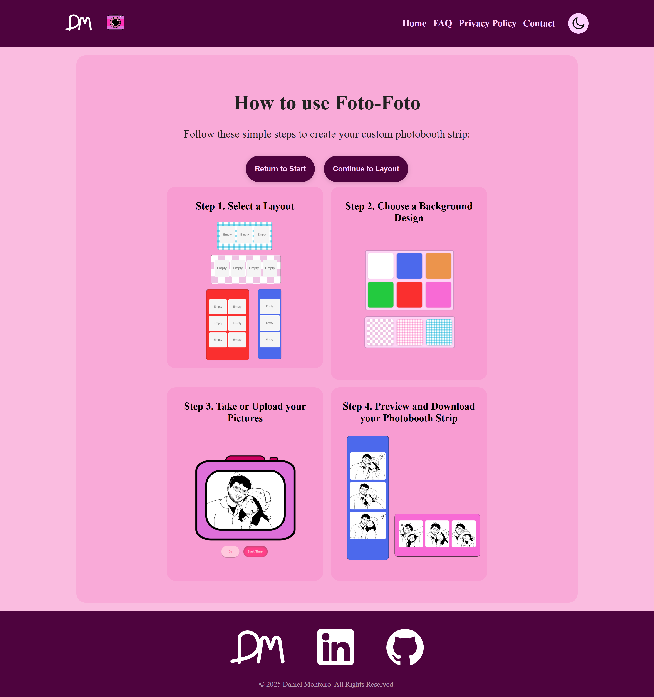
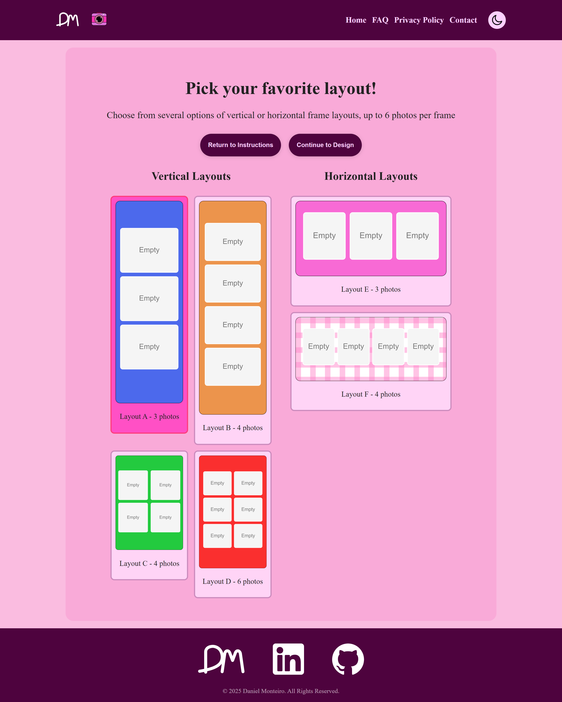
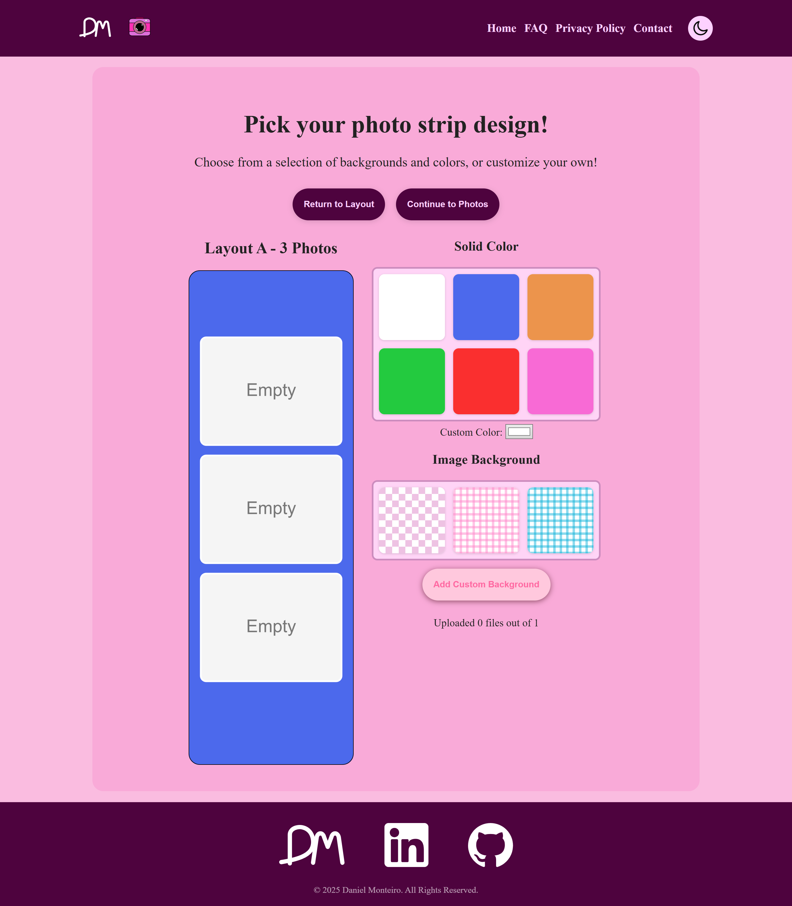
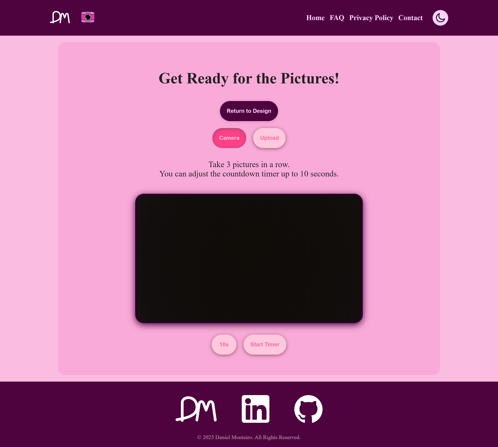
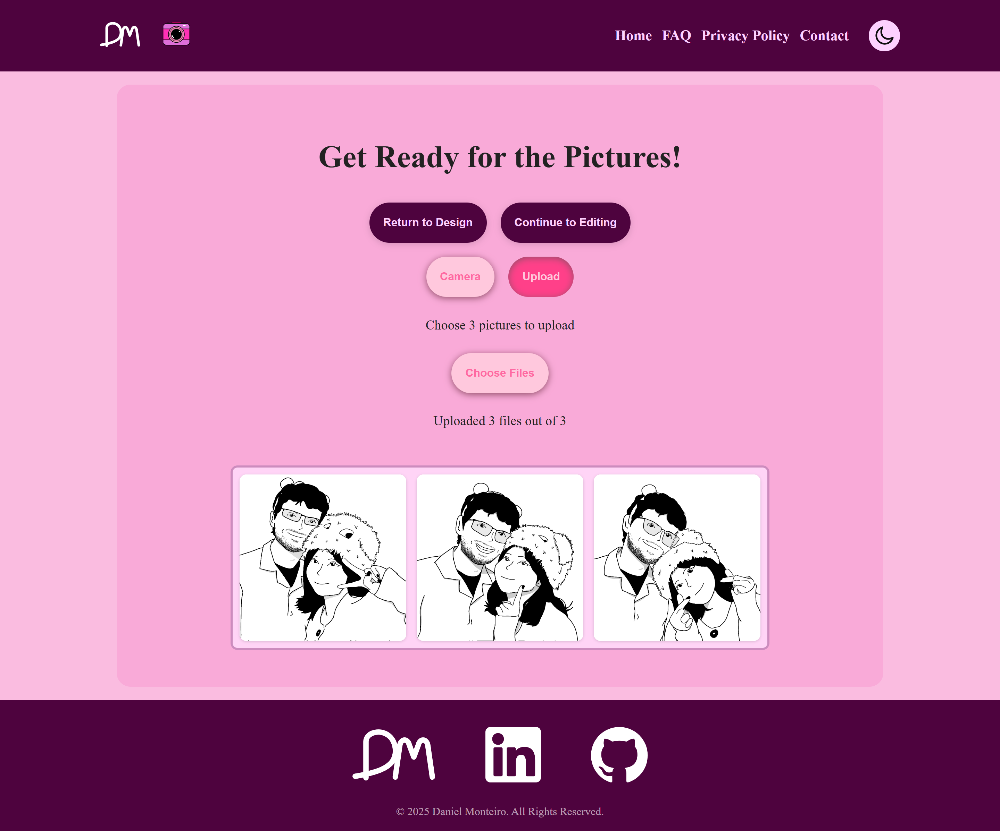
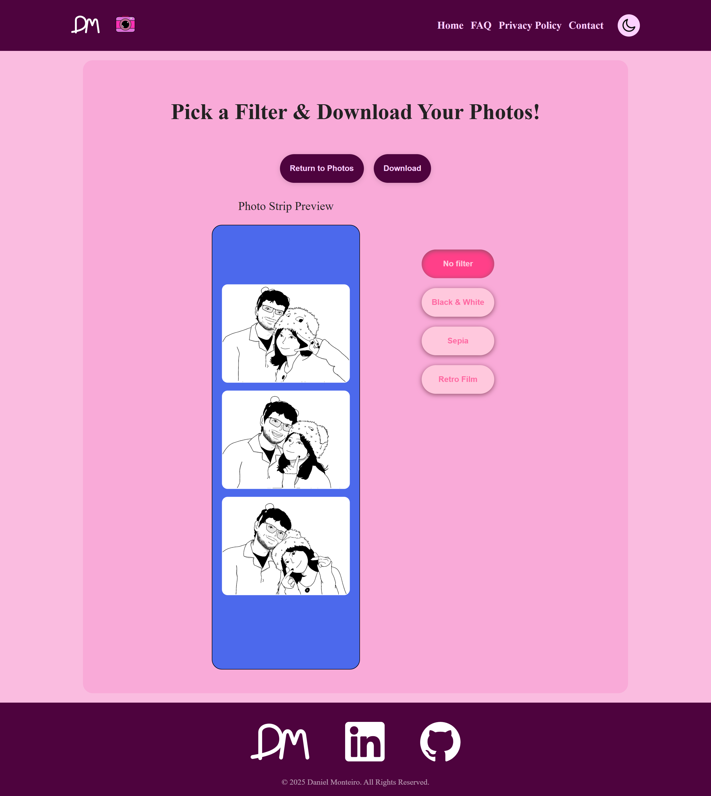

# Foto-Foto Photobooth


A client-side photobooth web app that captures, composes, and exports photo strips using native browser APIs — no backend required.

**Live Demo:** https://dmont1735.github.io/foto-foto-photobooth/

Foto-Foto Photobooth is a browser-based photobooth application built with React and Vite.
It leverages the MediaDevices API (`getUserMedia`) and Canvas processing to capture,
compose, and export photo strips entirely on the client.


## Requirements

- Must be run on `localhost` or HTTPS (camera access is blocked on insecure origins)
- Modern browser with webcam support (Chrome, Edge, Safari, Firefox)
- Camera access requires user permission when prompted by the browser

## Features

- Real-time camera preview and capture using the MediaDevices API (WebRTC)
- Option to upload existing images instead of using camera
- Multiple layout options (vertical & horizontal strips, up to 6 photos)
- Customizable backgrounds and color themes
- Built-in photo filters
- Instant photostrip generation and download
- Fully client-side — no uploads or backend required
- Privacy-friendly design — images never leave the user’s device
- Responsive design for desktop and mobile
- Fast performance with Vite
- Deployed using GitHub Pages

## Tech Stack

- **React**
- **Vite**
- **JavaScript (ES6+)**
- **CSS**
- **Web APIs**

## Screenshots

<table>
  <!-- Row 1 -->
  <tr>
    <td align="center">
      
      <br/>
      <sub><b>Start</b></sub>
    </td>
  </tr>

  <!-- Row 2 -->
  <tr>
    <td align="center">
      
      
      
      <br/>
      <sub><b>Learn → Choose Layout → Customize</b></sub>
    </td>
  </tr>

  <!-- Row 3 -->
  <tr>
    <td align="center">
      
      
      <br/>
      <sub><b>Take Photos or Upload</b></sub>
    </td>
  </tr>

  <!-- Row 4 -->
  <tr>
    <td align="center">
      
      <br/>
      <sub><b>Preview & Download</b></sub>
    </td>
  </tr>
</table>

## How It Works

1. Choose from several vertical or horizontal frame layouts,
   supporting up to 6 photos per strip.
2. Choose from a selection of backgrounds and colors, or customize your own.
3. Grant permission and take photos using your device camera directly,
   or upload existing images instead.
4. Choose a filter to add to your creation.
5. Download your Photobooth strip directly and enjoy!

## Architecture

The application streams camera input using `navigator.mediaDevices.getUserMedia()`
into a React component. Captured frames are drawn to an off-screen `<canvas>` for compositing, allowing layouts, filters, and background assets to be merged into a single bitmap before exporting. This avoids server-side image processing and keeps latency near-zero. All processing happens client-side to keep the app fast, private, and serverless.

## Getting Started

### Clone the repository

```bash
git clone https://github.com/dmont1735/foto-foto-photobooth.git
cd foto-foto-photobooth
```

### Install dependencies

```bash
npm install
```

### Run the app locally

```bash
npm run dev
```

Open your browser to the local dev server (usually `http://localhost:5173`) and allow camera access when prompted.

### Build for production

```bash
npm run build
```

The production-ready files will be generated in the `dist/` folder.

## License
MIT

## Author

Developed by Daniel Monteiro  
Feel free to reach out or explore more projects on my GitHub.
